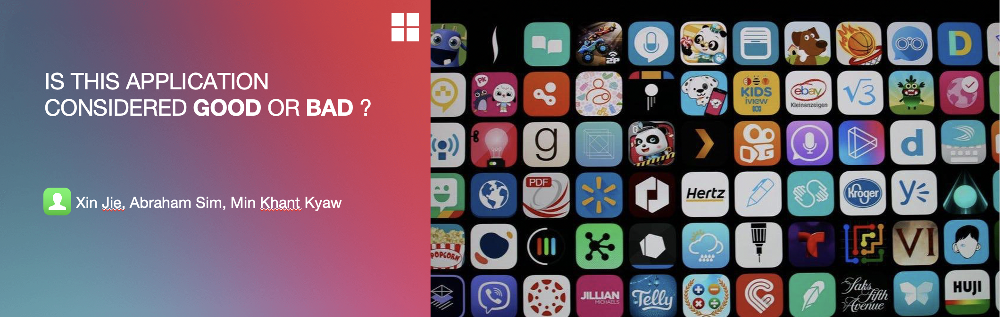

  

# SC1015 Mini-Project

# Table of Contents
1. Introduction
2. Contributors
3. Dataset
4. Problem Definition
5. Data Preparation
6. Exploratory Data Analysis
7. Machine Learning techniques
8. New Things We Learnt
9. References

## 1. Introduction
Hi everyone, this is a mini project for the course of SC1015, Introduction to Data Science and Artificial Intelligence.

In the project, it includes our motivation, an in-depth analysis of our data exploration and the algorithms that we have chosen and last, but not least our findings after the project.

The entire code in Jupyter Notebook can be found [here!](https://github.com/xinjiesg/SC1015-Mini-Project/blob/main/DSCi%20Group%20L%20finalv2.ipynb)

## 2. Contributors
-   @[xinjiesg](https://github.com/xinjiesg): **Xin Jie** - Problem Definition, and Model Research
-   @[Abeszz](https://github.com/Abeszz): **Abraham Sim** - EDA, Data Visualization, and Insights
-   @[min-khant-kyaw](https://github.com/min-khant-kyaw): **Min Khant Kyaw** - Code Combination, and Video Presentation

## 3. Dataset

Mobile App Store ( 7200 apps)
- https://www.kaggle.com/datasets/ramamet4/app-store-apple-data-set-10k-apps

## 4. Problem Definition

Our motivation for choosing this project comes from being a developer, we want to know whether our application is good enough to be on the app store and do not want to waste time building something that is not good.

## 5. Data Preparation

- We are explicitly going over each variable, reading its description, and understanding its true meaning, to judge if a variable that looks like a number should be considered numeric or categorical.

- We also clean dataset by only coping relevant variables and work on it. 

## 6. Exploratory Data Analysis

To perform a comprehensive Exploratory Data Analysis, we explore several basic statistical features of dataset, including:

- Uni-VariateStatistics

- Uni-Variate Visualization

- Bi-Variate Exploration

- Multi-Variate Exploration

- Normal Distribution

## 7. Machine Learning techniques

Once we done basic EDA, we start to build the actual Classification Model on the dataset. Multiple attempts are tried to find a model to predict if an app is good or bad based on our self-defined feature.

- Attempt 1: DecisionTreeClassifier with OneHotEncoding

- Attempt 2: DecisionTreeClassifier with Resampling

- Attempt 3: RandomForest

- Attempt 4: RandomForest with fine-tuned hyper-parameters

- Attempt 5: # GradientBoostingClassifier: LightGBM

  

## 8. New Things We Learnt

- Feature engineering by selecting, manipulating, and transforming raw data into features that can be used to predict if an app is good or not

- Resampling strategies for imbalanced datasets

- Understand the concept of Gradient boosting decision tree by using LightGBM

- Using GridSearch for hyper-parameters tuning

## 9. References

- Dataset: https://www.kaggle.com/datasets/ramamet4/app-store-apple-data-set-10k-apps

- LightGBM: https://rohitgr7.github.io/lightgbm-another-gradient-boosting/

- Price Prediction Case Study: https://towardsdatascience.com/mercari-price-suggestion-97ff15840dbd

- GradientBoostingClassifier Models Comparison: https://neptune.ai/blog/when-to-choose-catboost-over-xgboost-or-lightgbm

- Random Forest VS LightGBM: https://datascience.stackexchange.com/questions/63322/random-forest-vs-lightgbm
